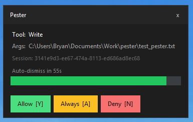

# Pester

Windows permission guardian for [Claude Code](https://claude.ai/code). Intercepts tool calls and shows a topmost popup so you can approve, deny, or always-allow them — without leaving your terminal.

Inspired by [Claude Guardian](https://github.com/anshaneja5/Claude-Guardian) (macOS).

---

## What it does

- **Popup on every tool call** — approve/deny with a keypress before Claude proceeds
- **System tray** — always visible; right-click for stats and config
- **Auto-approve / always-block lists** — skip the popup for tools you always trust (or never want)
- **Usage stats** — today's cost, tokens, and sessions at a glance
- **Auto-launches** — registers itself to start on Windows login

---

## Modes

### Service mode (recommended)
Pester installs itself as a Windows startup program. It launches automatically on login, runs in the system tray, and persists across reboots.

```powershell
powershell -ExecutionPolicy Bypass -File setup.ps1
```

To restart after a config change or update: right-click the tray icon → **Restart**.

To stop: right-click → **Quit**. It will relaunch on next login.

### On-demand mode
Run pester only when you need it, with no startup registration or registry changes. Good for testing, corporate machines, or if you'd rather launch it yourself.

```powershell
powershell -ExecutionPolicy Bypass -File run.ps1
```

This kills any existing instance, refreshes the Claude Code hooks in `~\.claude\settings.json`, ensures the user config exists, and starts a fresh instance. It does not add the Windows startup registry entry. Stop it via the tray or just close the process.

---

## Requirements

- Windows 10/11
- Python 3.11+ ([miniconda](https://docs.conda.io/en/latest/miniconda.html) or system)
- [Claude Code](https://claude.ai/code)

---

## Install

```powershell
git clone <this-repo> pester
cd pester
powershell -ExecutionPolicy Bypass -File setup.ps1
```

That's it. Pester will appear in your system tray and hook into every Claude Code session automatically.

---

## Usage

When Claude tries to use a tool, a popup appears in the bottom-right corner:



| Button | Key | Effect |
|--------|-----|--------|
| Allow | `Y` or `Enter` | Let this call through |
| Always | `A` | Allow now + add to auto-approve list |
| Deny | `N` or `Escape` | Block this call |

If you don't respond in time, the popup auto-resolves (deny by default — configurable).

---

## Configuration

Edit `%APPDATA%\pester\pester.config.json`:

```json
{
  "timeout_seconds": 60,
  "notify_only": false,
  "auto_deny_on_timeout": true,
  "auto_approve": ["Read", "Glob", "Grep", "LS"],
  "always_block": []
}
```

| Key | Default | Description |
|-----|---------|-------------|
| `timeout_seconds` | `60` | Seconds before popup auto-resolves |
| `notify_only` | `false` | Observer mode — no prompts, just notifications |
| `auto_deny_on_timeout` | `true` | `false` = fall back to Claude Code's own prompt on timeout |
| `auto_approve` | `[Read, Glob, Grep, LS]` | Tools silently allowed (no popup) |
| `always_block` | `[]` | Tools silently denied (no popup) |

You can also open the config from the tray: right-click → **Open Config**.

Clicking **Always** in the popup automatically appends the tool to `auto_approve` and saves.

---

## Tray menu

Right-click the tray icon:

- **Stats** — today's cost, sessions, messages, token counts + all-time totals
- **Open Config** — opens `pester.config.json` in your default editor
- **Quit** — stops pester (hooks fall through to Claude Code's default behavior)

---

## Notify-only mode

Set `"notify_only": true` to disable all permission prompts. Pester stays in the tray and shows notifications when Claude finishes, but never blocks a tool call.

Pester also detects when Claude Code is launched with `--dangerously-skip-permissions` and automatically enters notify-only mode for that session.

---

## Build a standalone .exe

```bat
build.bat
```

Produces `dist\pester.exe` — no Python required on the target machine.

---

## Uninstall

```powershell
powershell -ExecutionPolicy Bypass -File uninstall.ps1
```

Removes hooks from `~\.claude\settings.json`, removes the startup registry entry, and optionally deletes `%APPDATA%\pester\`.

---

## How it works

Claude Code fires hook scripts (registered in `~\.claude\settings.json`) before each tool call. There are two hook paths:

- **`pre_tool_use`** — fires for tools already in Claude Code's allow list. Pester intercepts these because Claude Code won't prompt for them on its own.
- **`permission_request`** — fires when Claude Code would show its own Yes/No prompt. Pester replaces that prompt with its popup.

Each hook sends a request to the pester app over localhost HTTP, then polls until you decide. The pester app shows the popup, waits for your input, and returns `allow` or `deny`. The hook forwards that back to Claude Code as a JSON response.

`setup.ps1` writes the hook commands into `~\.claude\settings.json` and adds a `HKCU\Software\Microsoft\Windows\CurrentVersion\Run` registry entry so pester starts on login.

If pester isn't running, hooks exit cleanly and Claude Code falls back to its own behavior — no hanging, no errors.
